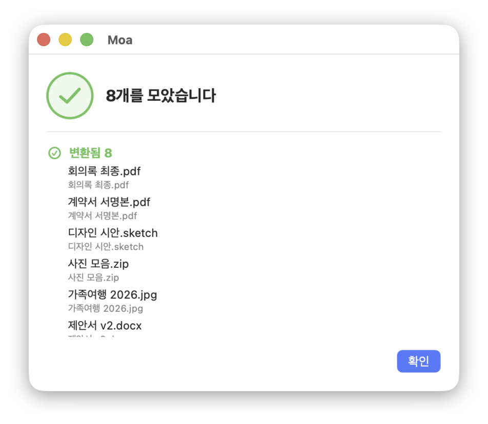

# 모아 (Moa)

맥에서 자소분리된 한글 파일명을 고쳐주는 macOS 앱.

  
  

## 이런 적 있다면

파일을 보냈는데 받은 사람(윈도우)에게 이름이 이렇게 보인 적이 있다면 이 앱이 필요하다.

| 보낸 방법 | 받은 쪽에 보이는 이름 |
| --- | --- |
| 파일을 그대로 전송 (메일·메신저·AirDrop) | `ㅅㅏㅈㅣㄴ ㅁㅗㅇㅡㅁ.zip` |
| Finder에서 "압축"해서 전송 | `꼮뀫꼳뀿넫 꼩뀳꼱뀽넽.zip` |

원인은 macOS가 파일명을 유니코드 **NFD**(풀어쓰기)로 저장하기 때문이다. 맥에서는 Finder가 알아서 모아 그려주므로 티가 나지 않는다. **파일이 맥 밖으로 나가는 순간에만 드러난다.**

둘째 줄은 원인이 하나 더 겹친다. macOS 기본 압축(`ditto`, `zip`)은 ZIP의 UTF-8 플래그(general purpose bit 11)를 세우지 않는다. 그러면 Windows 탐색기가 이름을 CP949로 잘못 해석해서, 자모가 흩어지는 정도가 아니라 아예 읽을 수 없는 글자가 된다.

## 하는 일

파일·폴더·ZIP을 창에 끌어다 놓으면 된다. Dock 아이콘에 바로 떨어뜨려도 동작한다.

**이름 고치기** — 이름을 NFC(모아쓰기)로 정규화한다. 폴더는 안쪽까지 훑고, 이미 온전한 이름은 건드리지 않는다.

**ZIP으로 묶기** — 이름을 고친 뒤 UTF-8 플래그를 세운 ZIP으로 내보낸다. macOS가 끼워 넣는 `__MACOSX`, `.DS_Store` 같은 군더더기도 뺀다. Windows에서 풀어도 이름이 온전하다.

**ZIP 청소하기** — 이미 만들어둔 ZIP을 떨어뜨리면 안쪽 이름을 고쳐 다시 묶어준다.

## 설치

[Releases](https://github.com/clichedmoog/Moa/releases)에서 최신 `Moa-1.0.dmg`를 받아 연다.

Developer ID로 서명하고 공증(notarization)까지 마쳤으므로 첫 실행에 보안 경고 없이 그냥 열린다. Apple Silicon과 Intel 모두 네이티브로 동작한다 (로제타 불필요).

## 알아두면 좋은 것

**이름 고치기는 APFS 볼륨에서만 유지된다.** HFS+와 exFAT은 macOS 드라이버가 파일명을 자소분리 형태로 되돌려 쓴다. 그런 외장하드나 USB로 옮길 거라면 이름을 고치는 대신 ZIP으로 묶는다 — ZIP 안의 이름은 파일시스템과 무관하게 그대로 간다.

**고쳐도 맥에서는 달라 보이지 않는다.** 원래 Finder에는 제대로 보이고 있었기 때문이다. 달라지는 건 파일이 맥을 떠난 다음이다.

## 만든 방식

설계 근거와 실측 기록은 [design spec](docs/superpowers/specs/2026-08-16-moa-design.md)에 있다. 파일시스템별 정규화 거동, Foundation이 경로를 NFD로 되돌리는 함정, App Sandbox 제약 같은 것들이다.

## 참고

같은 문제를 다루는 선행 앱으로 김남호 님의 [Contact](https://namocom.tistory.com/901)([소스](https://github.com/namhokim/cocoa_app), MIT)가 있다. 드래그앤드롭 UX와 마우스를 올렸을 때 파일 선택 버튼이 나타나는 아이디어를 참고했고, 코드는 별도로 작성했다.

Contact도 Swift와 Cocoa로 만들어졌다. 다만 배포된 바이너리가 인텔 전용(`x86_64`)이라 Apple Silicon에서는 로제타가 필요하고, 코드 사이닝이 없어 첫 실행에 보안 경고를 뚫어야 한다. 모아는 이 두 가지를 Universal 빌드와 서명·공증으로 해결한 것이 출발점이다.

변환 방식도 다르다. Contact는 `mv` 명령이 담긴 셸 스크립트를 만들어 실행하는데, 이는 Foundation이 파일 경로를 NFD로 되돌리는 문제를 우회하는 영리한 방법이었다. 모아는 App Sandbox 안에서 동작해야 해서 셸을 쓸 수 없었고, 그래서 POSIX `rename(2)`을 직접 호출한다. 더 나은 판단이었다기보다 제약이 달랐던 결과다.

## 라이선스

MIT
